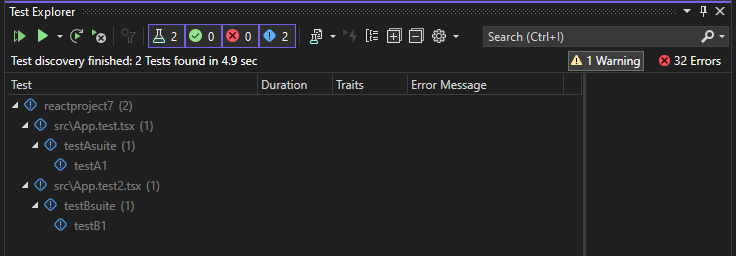

# DotNet React Testing

For functional testing, it's highly beneficial to create tests in a format that matches how users will be interacting with the system as possible. For API's which will be consumed from a UI it can be beneficial to test the interaction with the API from a typescript or javascript format using Jest.

If you are hoping to make sure your API is well tested and easily used by downstream systems you can create an NPM package that your 

## NPM Packaging

## Jest

## Visual Studio Setup

1. Create an ASP.NET Core Model-View-Controller project.
2. In Solution Explorer (right pane), right-click the ASP.NET Core project node and select Manage NuGet Packages for Solutions.
3. In the Browse tab, search for the following packages and install each one:

* Microsoft.TypeScript.MSBuild
* Npm
* Microsoft.JavaScript.UnitTest

Use the NuGet package to add TypeScript support instead of the npm TypeScript package

4. In Solution Explorer, right-click the project node and choose Edit Project File.
5. Add the following elements to the .csproj file in the PropertyGroup element.

```xml
<PropertyGroup>
   ...
   <JavaScriptTestRoot>tests\</JavaScriptTestRoot>
   <JavaScriptTestFramework>Jest</JavaScriptTestFramework>
   <GenerateProgramFile>false</GenerateProgramFile>
</PropertyGroup>
```

6. In Solution Explorer, right-click the ASP.NET Core project node and select Add > New Item. Choose the TypeScript JSON Configuration File, and then select Add.

If you don't see all the item templates, select Show All Templates, and then choose the item template.

Visual Studio adds the tsconfig.json file to the project root. You can use this file to configure options for the TypeScript compiler.

7. Open tsconfig.json and replace the default code with the following code:

```json
{
  "compileOnSave": true,
  "compilerOptions": {
     "noImplicitAny": false,
     "noEmitOnError": true,
     "removeComments": false,
     "sourceMap": true,
     "target": "es5",
     "outDir": "wwwroot/js"
  },
  "exclude": [
   "node_modules",
   "tests"
  ]
}
```

8. Right-click the project in Solution Explorer and choose Add > New Item (or press Ctrl + SHIFT + A). Use the search box to find the npm file, choose the npm Configuration File, use the default name, and click Add.
9. In Solution Explorer, right-click the npm node under Dependencies and choose Install new npm packages.

* jest
* jest-editor-support
* @types/jest

These packages are added to the package.json file under devDependencies.

```typescript
 "@types/jest": "^29.5.8",
 "jest": "^29.7.0",
 "jest-editor-support": "^31.1.2"
```

10. In package.json, add the test section at the end of the scripts section:

```json
"scripts": {
   ...
   "test": "jest"
},
```

11. In Solution Explorer, right-click the test folder and choose Add > New Item, and then add a new file named App.test.tsx.This adds the new file under the test folder.
12. Add the following code to App.test.tsx.
13. Open Test Explorer (choose Test > Windows > Test Explorer) and Visual Studio discovers and displays tests. If tests are not showing initially, then rebuild the project to refresh the list. The following illustration shows the Jest example, with two different unit test files.



```plaintext
*Note* For TypeScript, do not use the outfile option in tsconfig.json, because Test Explorer won't be able to find your unit tests. You can use the outdir option, but make sure that configuration files such as package.json and tsconfig.json are in the project root.
```

## Links

* <https://learn.microsoft.com/en-us/visualstudio/javascript/unit-testing-javascript-with-visual-studio?view=vs-2022&tabs=jest>
* <https://www.freecodecamp.org/news/how-to-create-and-publish-your-first-npm-package/>
